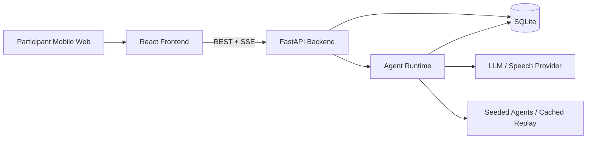

# 找到你：MVP 系统设计

## 1. 目标与边界

第一版的目标是让参与者认识值得交流的人，而不是自动组建队伍。系统必须展示：两个独立 Agent 基于各自已确认的画像和私有偏好，通过最多三轮交流获得新增信息、更新判断，并形成双向候选意向；真人才决定是否见面。

本设计服务于四小时 Hackathon MVP。它优先保证演示闭环、隐私边界和前后端可以并行开发，不追求生产级账号、支付、长期记忆或全局最优分配。

## 2. 推荐技术栈

| 层 | 推荐 | 原因 |
|---|---|---|
| 前端 | React + Vite + TypeScript + Tailwind | 手机网页开发快，组件和状态管理直接 |
| 后端 | FastAPI + Python + Pydantic | 语音、LLM 和状态机编排实现快，自动生成 OpenAPI |
| 数据库 | SQLite | 单机 Demo 足够，支持事务，便于种子数据和回放 |
| 实时更新 | Server-Sent Events (SSE)，轮询为降级方案 | Agent 事件只需要服务器推送到浏览器 |
| 语音与 LLM | 后端 Provider Adapter | API Key 不进入浏览器，可替换真实服务与 Mock |

如果团队更熟悉 Node.js，后端可换成 Express/NestJS；API、数据模型和状态机约束不变。不要让前端直接调用语音或 LLM 供应商。

## 3. 架构概览



后端中的 `Agent Runtime` 是消息传递和状态执行器，不是统一评审 Agent。每一次 Agent 模型调用只组装该 Agent 自己的已确认画像、私有偏好、候选公开广播、收到的消息和当前会话记忆。它不能读取其他 Agent 的私有偏好，也不能替对方接受或拒绝。

## 4. 前后端职责

| 领域 | 前端组负责 | 后端组负责 |
|---|---|---|
| 录音与转写 | 录音、上传、转写展示、预设文本入口 | 接收音频、调用语音服务、返回转写或 Mock |
| 画像确认 | 展示事实、Offer、Need、推断依据与权限开关 | 提取画像、校验结构、仅在确认后创建 Agent 上下文 |
| Agent 交流 | 消息时间线、三轮进度、判断变化、SSE 重连 | 逐 Agent 调用模型、状态机、消息持久化、轮次限制 |
| 候选意向 | 推荐卡、真人确认 UI、等待对方状态 | 双向意向判定、每人最多 5 张卡、真人确认状态 |
| 限额与隐私 | 显示“当前忙碌”、只显示允许的解释 | 原子执行入站上限、字段过滤、禁止跨 Agent 私有数据读取 |
| 演示兜底 | 切换预设转写与回放界面 | 种子参与者、缓存模型结果、回放事件流 |

前端不得拥有 LLM Key、音频原文持久化权限、其他参与者的私有偏好或 `private_reason`。后端不得依赖浏览器隐藏按钮来执行限制。

## 5. 核心数据模型

MVP 用 SQLite 表，复杂字段使用 JSON 文本保存；这样既能事务保护限额，也能快速调整画像 Contract。

### 5.1 `activities`

```text
id, name, status, matching_window_id, created_at
```

`status`: `DRAFT | OPEN | RUNNING | CLOSED`

### 5.2 `participants`

```text
id, activity_id, display_name, inbound_contact_count,
max_inbound_contacts, human_confirmation_status, created_at
```

`inbound_contact_count` 默认 `0`，`max_inbound_contacts` 固定为 `5`。它只在成功创建新会话时递增，拒绝、超时或关闭会话均不释放名额，直到下一个匹配窗口重置。

### 5.3 `profiles`

```text
participant_id, transcript_status, confirmed_profile_json,
public_broadcast, private_preferences_json, confirmed_at
```

`confirmed_profile_json` 包含 Facts、Offers、Explicit Needs、Inferred Needs 和 Evidence。只有用户确认且权限为 `public` 的字段可用于广播或发给其他 Agent；`private_preferences_json` 只能进入本人的 Agent Runtime。

### 5.4 `agents`

```text
id, participant_id, provider_mode, max_outbound_contacts,
outbound_contact_count, max_candidate_intents
```

`provider_mode`: `LIVE | SEEDED | REPLAY`。现场参与者通常为 `LIVE`，预设角色可以为 `SEEDED` 或 `REPLAY`。

### 5.5 `conversations`

```text
id, activity_id, initiator_agent_id, recipient_agent_id,
status, turn_count, max_turns, created_at, updated_at
```

`status`:

```text
PENDING_RESPONSE | ACTIVE | PROPOSED | MUTUAL_AGENT_INTENT |
DECLINED | EXPIRED | HUMAN_REJECTED | CONNECTED
```

同一活动内同一对 Agent 只能有一个有效会话。`turn_count` 最大为 `3`。

### 5.6 `messages`

```text
id, conversation_id, sender_agent_id, action,
public_message, created_at, round_number
```

只保存对方可见消息。`private_reason`、内部评分、私有偏好和 Prompt 不放在此表。

### 5.7 `agent_decisions`

```text
id, agent_id, conversation_id, decision_before, decision_after,
missing_information_json, new_information_json, private_reason, created_at
```

该表用于该 Agent 的后续决策和主人侧调试视图。返回给对方或公共页面时必须经过字段过滤。

### 5.8 `human_confirmations`

```text
conversation_id, participant_id, decision, created_at
```

只有双方 Agent 意向成立后才允许写入。两位参与者都提交 `ACCEPT` 后，`conversations.status` 才变成 `CONNECTED`。

### 5.9 `participant_sessions`

```text
token_hash, participant_id, expires_at, created_at
```

MVP 不做完整注册登录，但每次 `POST /participants` 必须返回一个不可猜测的临时会话令牌。浏览器在后续请求携带 `Authorization: Bearer <token>`；后端从令牌推导当前参与者，绝不信任前端传入的“我是哪个 participant”。所有 profile、会话、确认、SSE 和主人调试视图都按该身份过滤。

## 6. 状态机与硬约束

### 6.1 每轮如何计数

一轮从一方 `CONTACT`、`QUESTION`、`CLARIFY` 或 `PROPOSE` 开始，到另一方成功响应、明确 `DECLINE` 或超时结束。`PROPOSE -> ACCEPT/DECLINE` 也算一轮。第三轮结束后不能产生第四轮普通消息，只允许进入意向、拒绝或超时终态。

发起消息与回应消息共用同一个 `round_number`。会话处于 `PENDING_RESPONSE` 或 `PROPOSED` 时，只有被联系的一方可以回应；回应成功后，该回应方成为下一轮可发起者。超时把当前轮次计为已完成，并将会话置为 `EXPIRED`。前端只显示后端返回的 `round_number` 和 `next_actor_agent_id`，不在本地计算回合。

### 6.2 新建会话的原子操作

创建 `CONTACT` 必须由后端一个数据库事务完成：

```text
1. 检查发起方 outbound_contact_count < 3
2. 检查目标 inbound_contact_count < 5
3. 检查双方不存在有效会话
4. 原子递增发起方 outbound_contact_count 和目标 inbound_contact_count
5. 创建 conversation 与第一条 message
6. 提交事务；任一步失败则全部回滚
```

第 6 个并发入站联系返回 `409 TARGET_BUSY`。前端显示“当前忙碌”，不显示排队入口。拒绝和超时不释放本匹配窗口的入站额度。

### 6.3 Agent 行为约束

Agent Runtime 每一步必须输出结构化动作：

```json
{
  "action": "CONTACT | QUESTION | ANSWER | CLARIFY | PROPOSE | ACCEPT | DECLINE | WAIT",
  "recipient_agent_id": "agent_bob",
  "public_message": "你更希望只负责后端，还是也愿意参与产品范围讨论？",
  "decision_before": "uncertain",
  "decision_after": "uncertain",
  "missing_information": ["是否愿意参与产品判断"],
  "new_information": [],
  "private_reason": "主人希望队友共同参与产品判断"
}
```

后端在保存前校验：动作是否合法、目标是否属于当前会话、轮数是否耗尽、字段是否为空、`private_reason` 是否未进入公开消息。模型输出不通过校验时，运行一次修复 Prompt；仍失败则切换到缓存轨迹并记录错误。

### 6.4 双向意向与真人确认

```text
Agent A: PROPOSE
Agent B: ACCEPT
→ MUTUAL_AGENT_INTENT
→ 生成双方候选卡
→ A 真人确认 / B 真人确认
→ 两人均确认后 CONNECTED
```

每个 Agent 最多保留 5 个候选交流意向。超过 5 个时，由该 Agent 根据主人的私有偏好选择保留或拒绝；平台不统一排序。单人现场演示应停在“一方已确认、等待对方确认”，而不假装连接已完成。

候选上限在保存 `ACCEPT` 前由后端事务检查。若接受会让任一 Agent 超过 5 个候选意向，该 Agent Runtime 必须先输出 `DECLINE`，结束它自己已有的一条未真人确认候选关系；该决定和对方可见的结束消息必须先持久化，之后才能接受新意向。任何一方没有可释放或不愿释放的候选时，新的 `ACCEPT` 退化为 `DECLINE`。已由真人确认的连接不能被 Agent 自动替换。候选额度只计算 `MUTUAL_AGENT_INTENT` 状态；`DECLINED`、`EXPIRED` 和 `HUMAN_REJECTED` 会释放候选额度，但不会释放入站联系额度。

### 6.5 会话迁移表

`HUMAN_PENDING` 从状态枚举中移除：`MUTUAL_AGENT_INTENT` 本身就是“候选卡已生成、等待真人确认”的状态。

| 当前状态 | 合法动作 | 下一状态 |
|---|---|---|
| 无会话 | `CONTACT` | `PENDING_RESPONSE` |
| `PENDING_RESPONSE` | `ANSWER` / `CLARIFY` | `ACTIVE` |
| `PENDING_RESPONSE` | `DECLINE` / 超时 | `DECLINED` / `EXPIRED` |
| `ACTIVE` | `QUESTION` / `CLARIFY` | `PENDING_RESPONSE` |
| `ACTIVE` | `PROPOSE` | `PROPOSED` |
| `PROPOSED` | `ACCEPT` | `MUTUAL_AGENT_INTENT` |
| `PROPOSED` | `DECLINE` / 超时 | `DECLINED` / `EXPIRED` |
| `MUTUAL_AGENT_INTENT` | Agent 撤回未真人确认的候选 | `DECLINED` |
| `MUTUAL_AGENT_INTENT` | 一方真人 `ACCEPT` | `MUTUAL_AGENT_INTENT` |
| `MUTUAL_AGENT_INTENT` | 双方真人 `ACCEPT` | `CONNECTED` |
| `MUTUAL_AGENT_INTENT` | 任一真人 `REJECT` | `HUMAN_REJECTED` |

`DECLINED`、`EXPIRED`、`HUMAN_REJECTED` 和 `CONNECTED` 都是终态。每个匹配窗口内，两个 Agent 的无序组合只能有一条关系记录，即使终态也不能再次 `CONTACT`；下一个匹配窗口才允许重新认识。

## 7. API Contract

统一前缀：`/api/v1`。前端以 OpenAPI 生成 TypeScript 类型，接口字段一旦联调后不随意改名。HTTP 请求、响应和 SSE 事件统一使用 `camelCase`；SQLite 列名和后端内部 Pydantic 字段可以使用 `snake_case`，由后端序列化层转换。

### 7.1 画像与录音

| 方法 | 路径 | 用途 |
|---|---|---|
| `POST` | `/participants` | 创建临时参与者 |
| `POST` | `/participants/{id}/recording` | 上传音频并返回转写与画像草稿 |
| `POST` | `/participants/{id}/profile-draft` | 使用预设转写文本生成草稿 |
| `PUT` | `/participants/{id}/profile` | 保存用户确认后的画像与权限 |
| `GET` | `/participants/{id}/profile` | 获取本人可编辑画像 |

`POST /participants` 请求只需要活动与显示名：

```json
{ "activityId": "act_demo", "displayName": "Alice" }
```

`POST /participants` 响应：

```json
{
  "participant": { "id": "p_alice", "activityId": "act_demo" },
  "accessToken": "opaque-temporary-token"
}
```

`recording` 与 `profile-draft` 使用相同的草稿响应：

```json
{
  "draft": {
    "transcript": "仅用于本次确认，确认后删除",
    "items": [
      {
        "id": "need_scope",
        "kind": "inferred_need",
        "text": "希望有人帮助缩小项目范围",
        "evidence": "我有三个方向但不知道先做哪一个",
        "confirmed": false,
        "visibility": "private"
      }
    ]
  }
}
```

`PUT /participants/{id}/profile` 请求：

```json
{
  "displayName": "Alice",
  "items": [
    {
      "id": "need_scope",
      "kind": "inferred_need",
      "text": "希望有人帮助缩小项目范围",
      "evidence": "我有三个方向但不知道先做哪一个",
      "confirmed": true,
      "visibility": "private"
    }
  ]
}
```

确认成功后，后端创建或刷新本人 Agent，并删除原始音频与完整转写的临时文件。

所有 `{id}` 路径仍需校验其归属当前会话令牌；不归属时统一返回 `404`，避免泄露参与者是否存在。

### 7.2 发现、运行与事件

| 方法 | 路径 | 用途 |
|---|---|---|
| `GET` | `/activities/{id}/broadcasts` | 获取可见公开广播 |
| `POST` | `/activities/{id}/runs` | 启动当前用户 Agent 的一次协商运行 |
| `GET` | `/activities/{id}/events` | SSE：消息、判断变化、状态事件 |
| `GET` | `/conversations/{id}` | 获取当前用户可见的会话详情 |
| `GET` | `/me/conversations` | 获取当前用户可见会话，用于 SSE 重连同步 |
| `GET` | `/participants/{id}/candidate-intents` | 获取本人最多 5 张候选卡 |
| `GET` | `/conversations/{id}/my-decision` | 获取当前主人自己的私有判断说明 |

`POST /activities/{id}/runs` 不接受“替 Agent 写消息”的正文：

```json
{
  "mode": "live",
  "replay_track_id": null,
  "max_steps": 1
}
```

后端从会话令牌确定发起 Agent。`max_steps` 在 MVP 固定为 `1`，每次请求只运行该 Agent 的一个结构化动作；收到对方实时或种子 Agent 的回应后，再由后端排入下一次运行。`mode: "replay"` 必须提供 `replay_track_id`，并且只读取该轨迹的缓存事件。这样 Agent 发起联系的决定不会由前端伪造，也不会出现一次请求把全场会话全部跑完的不可控行为。

后端的 `AgentScheduler` 使用内存队列即可。队列项为 `{conversationId, expectedStatus, expectedNextActorId}`：出队时再次校验三项，避免 SSE 重连或重复请求造成双回复；每个队列项只执行该 Agent 的一个动作。`LIVE` Agent 的单步动作完成后，若对方有待处理消息，就把对方加入队列；`SEEDED` 角色走同一流程；`REPLAY` 角色只追加预先定义的下一事件。队列异常时由 Replay 轨迹接管，不阻塞前端。

SSE 连接按当前会话令牌过滤：每个浏览器只收到自己参与的会话、自己可见的候选卡和活动公共广播。每条事件包含单调递增的 `id`；前端重连时发送 `Last-Event-ID`，后端按顺序重放仍对该用户可见的遗漏事件。若事件保留期外或发现缺口，发送 `sync.required`，前端调用 `GET /me/conversations` 和候选卡接口完成全量同步。

SSE 事件：

```json
{
  "id": "evt_000123",
  "type": "agent.decision.updated",
  "conversationId": "conv_123",
  "data": {
    "actor": "Alice Agent",
    "action": "QUESTION",
    "publicMessage": "你在活动期间可以投入多长时间？",
    "decisionBefore": "uncertain",
    "decisionAfter": "uncertain",
    "newInformation": [],
    "roundNumber": 2
  }
}
```

事件中不包含 `private_reason`。主人本人查看自己的调试说明时，使用单独的受保护接口。

### 7.3 响应与字段可见性 Contract

以下响应必须在第 30 分钟前冻结为 OpenAPI Schema 和 JSON Fixture：

```typescript
type Visibility = "public" | "private" | "disabled";

type ProfileItem = {
  id: string;
  kind: "fact" | "offer" | "explicit_need" | "inferred_need" | "preference";
  text: string;
  evidence?: string;
  confirmed: boolean;
  visibility: Visibility;
};

type Broadcast = {
  agentId: string;
  displayName: string;
  message: string;
  contactStatus: "available" | "busy";
};

type ConversationView = {
  id: string;
  status: string;
  turnCount: number;
  maxTurns: 3;
  nextActorAgentId?: string;
  messages: Array<{ roundNumber: number; senderName: string; action: string; text: string }>;
  visibleDecisions: Array<{ actor: string; before: string; after: string; newInformation: string[] }>;
};

type CandidateIntentCard = {
  conversationId: string;
  counterpart: { displayName: string; publicOffer: string[]; publicNeed: string[] };
  newlyConfirmed: string[];
  openQuestions: string[];
  status: "awaiting_my_confirmation" | "waiting_for_counterpart" | "connected" | "rejected";
};
```

字段过滤规则：本人 `GET /profile` 可读所有已确认项和推断依据；其他 Agent 只能读 `visibility: public` 的文本，不读 Evidence；`visibility: private` 不进入广播、其他 Agent 的模型上下文、消息或候选卡；`visibility: disabled` 仅在本人确认页的临时草稿中保留，不进入 Agent Runtime、持久画像快照或任何后续 API 响应。候选卡只能读取公开字段和双方在会话中明确发出的消息，不能直接读取 `private_reason` 或私有画像。

### 7.4 真人确认

| 方法 | 路径 | 用途 |
|---|---|---|
| `POST` | `/conversations/{id}/human-confirmations` | 当前参与者接受或拒绝候选连接 |
| `GET` | `/conversations/{id}/confirmation-status` | 查询双方确认状态 |

```json
{ "decision": "ACCEPT" }
```

状态非法时返回 `409`，例如尚未形成双方 Agent 意向就请求真人确认。

### 7.5 错误码

| 状态 | code | 前端表现 |
|---|---|---|
| `409` | `TARGET_BUSY` | 显示“当前忙碌”，从候选中移除 |
| `409` | `OUTBOUND_LIMIT_REACHED` | 显示“你的 Agent 已完成 3 次主动联系” |
| `409` | `TURN_LIMIT_REACHED` | 显示“三轮交流已结束，等待意向或结束” |
| `409` | `INVALID_STATE` | 刷新当前会话状态 |
| `422` | `PROFILE_NOT_CONFIRMED` | 引导回画像确认 |
| `503` | `PROVIDER_UNAVAILABLE` | 提供预设转写或回放入口 |

所有错误采用同一包络，便于前端只写一套处理逻辑：

```json
{
  "error": {
    "code": "TARGET_BUSY",
    "message": "当前忙碌，请稍后再试",
    "requestId": "req_123"
  }
}
```

## 8. 前端组实现清单

### 页面与组件

1. **入口页**：创建参与者、选择“录音”或“使用预设文本”。
2. **录音页**：录音计时、上传状态、转写加载和失败重试。
3. **画像确认页**：Facts、Offers、Needs、推断依据；每项确认、编辑、公开/私有/禁用开关。
4. **Agent 广播页**：本人广播和可见候选广播，展示联系额度 `0/3` 与忙碌状态。
5. **协商页**：按轮展示双方消息、当前第几轮、关键新增信息、双方判断变化。
6. **候选卡页**：双方能提供什么、协商新确认的信息、待确认问题、真人确认按钮。
7. **回放模式**：按事件顺序播放与真实模式同形的事件流。

### 前端状态边界

- 使用 TanStack Query 或等价方案管理 REST 缓存；SSE 只用于追加事件后失效相应查询。
- 只根据后端 `status` 渲染按钮可用性，不能在本地推断 Agent 是否已经接受。
- 页面切换或 SSE 断线后，通过 `GET /conversations/{id}` 恢复，不依赖浏览器内存。
- 头像、昵称、消息和推荐理由必须来自 API 的公开字段；不要把完整 profile 放进全局 store。

## 9. 后端组实现清单

### 模块划分

```text
app/
  api/            # 路由、鉴权占位、SSE
  schemas/        # Pydantic 请求/响应与 Agent Action Contract
  services/
    profile.py    # 转写、画像提取、确认与字段权限过滤
    agents.py     # 单 Agent 上下文组装、模型调用、输出校验
    workflow.py   # 会话状态机、轮次和双向意向
    limits.py     # 原子入站/出站限制
    replay.py     # 缓存轨迹和种子角色
  repositories/   # SQLite 事务与查询
  providers/      # speech/llm 的可替换 Adapter
  tests/
```

### 必须优先完成的后端顺序

1. Pydantic Schema、SQLite 表和种子 4 名参与者；
2. `profile-draft`、`profile` 和预设转写入口；
3. 会话创建事务和硬限制测试；
4. Agent Action Contract 校验与固定轨迹；
5. SSE 事件流；
6. 真实语音和真实 LLM Provider；
7. 真人确认和回放模式。

先让 `REPLAY` 路径跑通完整三轮和双向意向，再接 `LIVE` Provider。这样前端不会被外部 API 的延迟或失败阻塞。

## 10. 联调计划

### 共同冻结的 Contract

第 30 分钟前，前后端共同确认：

- `ProfileItem` 的字段和权限枚举；
- `ConversationStatus`、`AgentAction` 与 SSE 事件类型；
- 错误码；
- 候选卡响应结构；
- 4 个预设参与者和一条完整三轮轨迹。

后端先用 OpenAPI 或 JSON Fixture 提供给前端；前端同时用同一份 Fixture 开发，不等待接口完成。

### 建议节奏

| 时间 | 前端组 | 后端组 | 共同验收 |
|---|---|---|---|
| 0:00-0:30 | 页面骨架与 API 类型 | Schema、种子数据、Fixture | 冻结 Contract |
| 0:30-1:30 | 录音、画像确认、广播 | 画像草稿、确认、会话限额 | 可保存确认画像 |
| 1:30-2:30 | 协商时间线与状态卡 | Replay 状态机、SSE | 三轮轨迹完整显示 |
| 2:30-3:15 | 候选卡、真人确认、截图布局 | Live Provider、确认状态 | 双向 Agent 意向 |
| 3:15-4:00 | 移动端排版、Demo 排练 | 错误回退、缓存和数据重置 | 录音与回放均可跑 |

## 11. 必测场景

1. 用户确认一条推断需求为私有后，对方 Agent、广播和候选卡均看不到该文本。
2. 同一 Agent 第 4 次 `CONTACT` 被拒绝，且不创建会话。
3. 同一目标第 6 个并发 `CONTACT` 返回 `TARGET_BUSY`，计数保持为 5。
4. 已拒绝或超时会话不释放热门参与者的入站名额。
5. 一对 Agent 在第 3 轮后不能发送第 4 轮普通消息。
6. 只有 `PROPOSE` 加 `ACCEPT` 才生成候选卡；单方提案不生成。
7. 只有双方真人确认才显示 `CONNECTED`。
8. LLM 输出非法 JSON 时，系统显示回放轨迹而不让页面卡死。
9. 手机宽度下，三轮消息、状态卡和确认按钮可在单屏截图中看清，文本不截断。

## 12. 不进入第一版的内容

- 真实身份认证、完整活动管理后台和邀请体系；
- 向量数据库、全场最优分配和中央 LLM 对照组；
- 无限 Agent 群聊或跨活动长期记忆；
- 自动交换联系方式、自动建队；
- 生产级内容审核、审计和数据保留治理。

## 13. 演示前检查

- 真实语音 API 可用，且预设文本入口可立即切换；
- 4 个种子 Agent、缓存轨迹和重置数据库脚本可用；
- 三轮协商包含一次拒绝、一次新增信息和一次双方 Agent 意向；
- 一张截图能清楚呈现轮次、消息、判断变化和候选状态；
- 热门参与者第 6 次入站联系显示“当前忙碌”；
- 单人 Demo 不声称双方真人已经确认。
